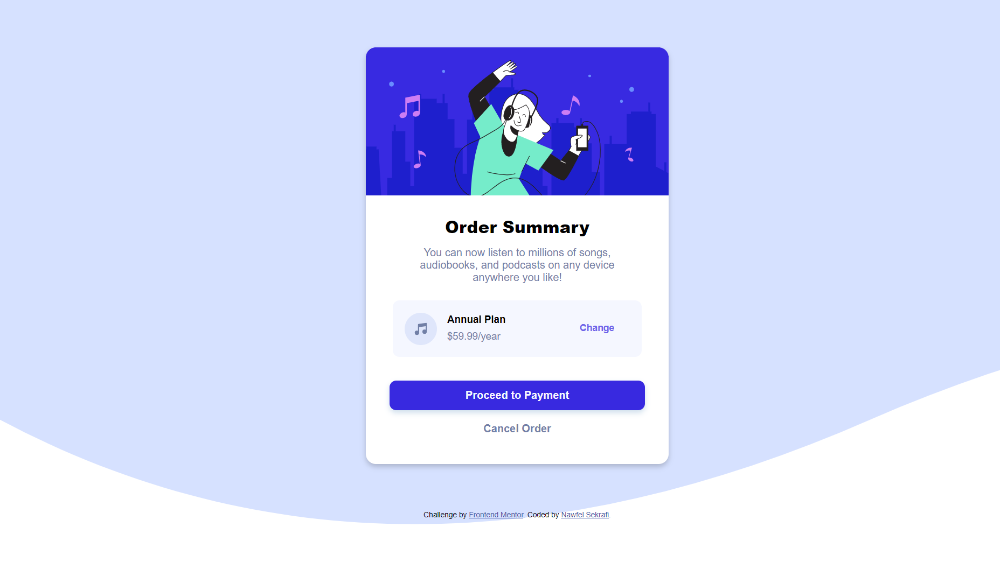
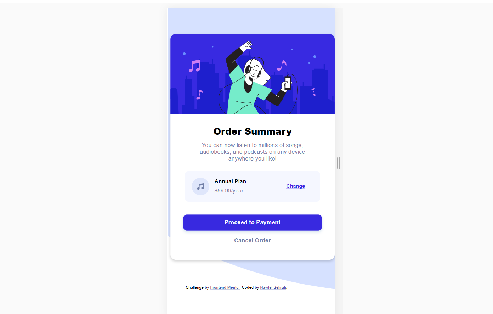

# Frontend Mentor - Order summary card solution

This is a solution to the [Order summary card challenge on Frontend Mentor](https://www.frontendmentor.io/challenges/order-summary-component-QlPmajDUj). Frontend Mentor challenges help you improve your coding skills by building realistic projects.

## Table of contents

- [Overview](#overview)
  - [The challenge](#the-challenge)
  - [Screenshot](#screenshot)
  - [Links](#links)
- [My process](#my-process)
  - [Built with](#built-with)
  - [What I learned](#what-i-learned)
  - [Continued development](#continued-development)
  - [Useful resources](#useful-resources)
- [Author](#author)
- [Acknowledgments](#acknowledgments)

## Overview

### The challenge

Users should be able to:

- See hover states for interactive elements

### Screenshot

- Desktop design

-Mobile design

### Links

- Solution URL: [GitHub](https://github.com/nawfelsekrafi/Order-summary-component)
- Live Site URL:[Live demo](https://nawfelsekrafi.github.io/Order-summary-component/)

## My process

### Built with

- Semantic HTML5 markup
- CSS3
- Flexbox
- Responsive web design

### What I learned

Working on real world projects was a threshold  for me.
I am happy that FronEndMontor give us the chance to evaluate our skills.
I leaned the use of the browser dev tools, css flex, hosting the project on github Pages, and wrinting md files and much more.

### Continued development

I want to focus more on Css grid, hsl colors...

### Useful resources

- [Working with a Live Server](https://marketplace.visualstudio.com/items?itemName=ritwickdey.LiveServer) - This helped me reduce the working time . I really liked this pattern and will use it going forward in all my projects.
- [markdownlint : Markdown Preview](https://marketplace.visualstudio.com/items?itemName=DavidAnson.vscode-markdownlint) - This is an amazing extention which helped me Preview Md files. I'd recommend it to anyone still learning this concept.

## Author

- Website - [Nawfel Sekrafi](https://www.tunisian-coder.me)
- Frontend Mentor - [@nawfelsekrafi](https://www.frontendmentor.io/profile/nawfelsekrafi)

## Acknowledgments

I would say thanks to brother [Mohamed Abusrea](https://twitter.com/mohamed_abusrea) for directing me to Front end mentor and sharing knowledge with us.
